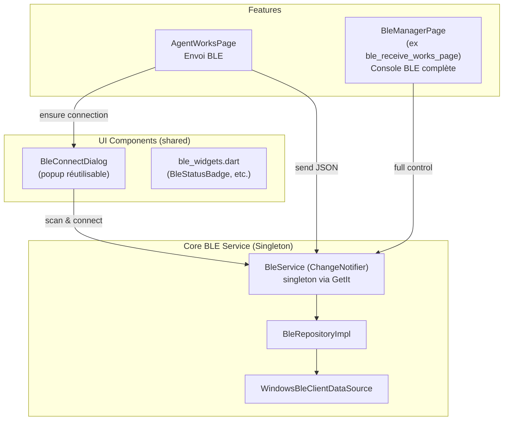

# Unification du Service Bluetooth BLE

Refactoring complet de l'architecture BLE pour centraliser la gestion de connexion, créer un service global réutilisable, et ajouter une popup de connexion BLE automatique avant l'envoi de données.

## Problèmes Actuels

1. **Duplication massive** : `BleBloc` et `BleReceiveWorksBloc` créent chacun leur propre `BleRepositoryImpl(WindowsBleClientDataSource())` — deux instances distinctes qui ne partagent pas l'état de connexion.
2. **Pas de vérification de connexion** : Dans `agent_works_page.dart`, `_sendBle()` fait un `context.read<BleBloc>()` qui plante si aucun `BlocProvider<BleBloc>` n'est dans l'arbre (et il n'y est pas — le `BleBloc` n'est fourni que dans `BleReceiverPage`).
3. **Code BLE éclaté** : Logique identique réécrite dans 3 fichiers différents.

## Architecture Proposée

## Proposed Changes

### 1. Core BLE Service (nouveau)

#### [NEW] [ble_service.dart](file:///c:/WORKSPACE/amex5/lib/core/ble/ble_service.dart)

Service BLE centralisé (singleton `@singleton` via GetIt), basé sur `ChangeNotifier` pour réactivité UI.

- **État** : `BleConnectionState` (disconnected, scanning, connecting, connected, sending, error)
- **Propriétés réactives** : `connectedDevice`, `connectionState`, `isConnected`, `scanResults`, `history` (journal JSON)
- **Méthodes publiques** :
  - `startScan()` / `stopScan()`
  - `connectToDevice(BleDeviceEntity)`
  - `disconnect()`
  - `sendJson(Map<String, dynamic>)` → `Future<void>`
  - `Future<bool> ensureConnected(BuildContext context)` — helper qui vérifie la connexion et ouvre la popup si nécessaire
- Encapsule un seul `BleRepository` partagé par toute l'app
- Gère les subscriptions (scan, JSON, connexion) et la réassemblage JSON

---

### 2. Popup de connexion BLE réutilisable (nouveau)

#### [NEW] [ble_connect_dialog.dart](file:///c:/WORKSPACE/amex5/lib/core/ble/ble_connect_dialog.dart)

`Future<bool> showBleConnectDialog(BuildContext context)` — dialog modal :

1. Lance automatiquement le scan via `BleService`
2. Affiche les appareils trouvés avec RSSI
3. Au clic : connexion → affiche spinner → retourne `true` quand connecté
4. Retourne `false` si annulé ou erreur
5. Réutilisable depuis n'importe quelle page via `await showBleConnectDialog(context)`

---

### 3. Modifications des pages existantes

#### [MODIFY] [agent_works_page.dart](file:///c:/WORKSPACE/amex5/lib/features/agent_works/presentation/pages/agent_works_page.dart)

- `_sendBle()` : Remplacer `context.read<BleBloc>()` par `getIt<BleService>()`
- Avant l'envoi, appeler `await bleService.ensureConnected(context)` qui lance la popup si pas connecté
- Supprimer l'import de `ble_bloc.dart`

#### [MODIFY] [ble_receive_works_page.dart](file:///c:/WORKSPACE/amex5/lib/features/ble_receive_works/presentation/pages/ble_receive_works_page.dart)

Transformer en **page de gestion BLE complète** :

- **Panneau connexion** : état de connexion, bouton se connecter/déconnecter (consomme `BleService`)
- **Panneau scan** : se connecter à d'autres appareils
- **Panneau test JSON** : saisir et envoyer du JSON de test, voir les réponses
- **Journal BLE** : historique envoyé/reçu (réutilise les widgets existants)
- **Garder** la logique de réception des travaux (désérialisation WoModel + envoi API)

#### [MODIFY] [ble_receive_works_bloc.dart](file:///c:/WORKSPACE/amex5/lib/features/ble_receive_works/presentation/bloc/ble_receive_works_bloc.dart)

- Supprimer la création locale de `BleRepositoryImpl(WindowsBleClientDataSource())`
- Injecter `BleService` depuis GetIt
- Consommer les streams de `BleService` au lieu de gérer ses propres subscriptions BLE
- Conserver la logique métier de réception/envoi des travaux (parsing JSON → WoModel → API)

#### [DELETE] [ble_receiver_page.dart](file:///c:/WORKSPACE/amex5/lib/features/ble_receiver/presentation/pages/ble_receiver_page.dart)

La page `BleReceiverPage` devient redondante car toute sa logique (scan, connexion, envoi/réception JSON, journal) sera intégrée dans la page BLE Manager (`ble_receive_works_page.dart`).

#### [DELETE] [ble_bloc.dart](file:///c:/WORKSPACE/amex5/lib/features/ble_receiver/presentation/bloc/ble_bloc.dart)

Remplacé par `BleService` global.

---

### 4. App Shell & Navigation

#### [MODIFY] [app_shell.dart](file:///c:/WORKSPACE/amex5/lib/app/app_shell.dart)

- Supprimer l'entrée de navigation "BLE Receiver" (l'ancien `BleReceiverPage`)
- Renommer "Déchargement travaux" → "Gestion BLE" dans la sidebar
- Ajouter un indicateur de connexion BLE dans le footer (consomme `BleService`)

---

### 5. Widgets partagés

#### [MODIFY] [ble_widgets.dart](file:///c:/WORKSPACE/amex5/lib/features/ble_receiver/presentation/widgets/ble_widgets.dart)

- Déplacer vers `lib/core/ble/widgets/ble_widgets.dart` pour accès global
- Adapter `BleStatusBadge` pour consommer `BleService` au lieu de `BleState`
- Garder tous les widgets visuels (RssiBar, BleDeviceTile, BleJsonEntry, etc.)

---

### 6. Entities & Repository (déplacement)

#### [MOVE] Les fichiers suivants de `lib/features/ble_receiver/` vers `lib/core/ble/`

- `domain/entities/ble_device_entity.dart` → `lib/core/ble/entities/ble_device_entity.dart`
- `domain/repositories/ble_repository.dart` → `lib/core/ble/repositories/ble_repository.dart`
- `data/datasources/ble_data_source.dart` → `lib/core/ble/datasources/ble_data_source.dart`
- `data/repositories/ble_repository_impl.dart` → `lib/core/ble/repositories/ble_repository_impl.dart`

> [!IMPORTANT]
> Ces fichiers passent dans `core/ble/` car ils sont consommés par **plusieurs features** (agent_works, ble_receive_works) et ne sont pas spécifiques à une seule feature.

---

## Résumé des fichiers

| Action   | Fichier                                     | Raison                                          |
|----------|---------------------------------------------|------------------------------------------------|
| **NEW**  | `lib/core/ble/ble_service.dart`             | Service BLE centralisé singleton               |
| **NEW**  | `lib/core/ble/ble_connect_dialog.dart`      | Popup connexion réutilisable                   |
| **MOVE** | `ble_data_source.dart` → `core/ble/`        | Shared infra                                   |
| **MOVE** | `ble_repository.dart` → `core/ble/`         | Shared contract                                |
| **MOVE** | `ble_repository_impl.dart` → `core/ble/`    | Shared impl                                    |
| **MOVE** | `ble_device_entity.dart` → `core/ble/`      | Shared entity                                  |
| **MOVE** | `ble_widgets.dart` → `core/ble/widgets/`    | Shared UI components                           |
| **MOD**  | `agent_works_page.dart`                     | Utiliser BleService + popup                    |
| **MOD**  | `ble_receive_works_page.dart`               | Page console BLE complète                      |
| **MOD**  | `ble_receive_works_bloc.dart`               | Consommer BleService au lieu de BleRepo direct |
| **MOD**  | `app_shell.dart`                            | Supprimer nav BLE Receiver, ajouter indicateur |
| **DEL**  | `ble_receiver_page.dart`                    | Fonctionnalités fusionnées                     |
| **DEL**  | `ble_bloc.dart`                             | Remplacé par BleService                        |

## Verification Plan

### Automated Tests
- `flutter analyze` — vérifier qu'aucune erreur de compilation ne subsiste
- Vérifier qu'aucun import ne pointe vers les fichiers supprimés

### Manual Verification
- Vérifier que la popup BLE s'ouvre depuis `AgentWorksPage` → BLE → confirmer la connexion
- Vérifier que la page BLE Manager permet : scan, connexion, déconnexion, envoi/réception JSON, réception de travaux
- Vérifier que l'indicateur BLE dans la sidebar reflète l'état de connexion en temps réel
